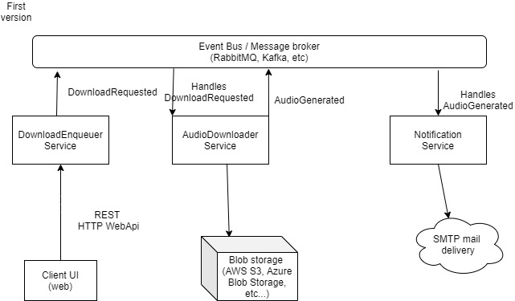

# Project documentation
This repository contains project documentation.

## Project Roadmap

This document covers the upcoming task for the project to achieve MVP

| #   | Epic                                                            | Status      |
| --- | --------------------------------------------------------------- | ----------- |
| 1   | Investigate messaging platforms state of art                    | {issueLink} |
| 2   | Create POC of publisher/subscriber components using message bus | {issueLink} |
| 3   | Create POC of blob management for audios                        | {issueLink} |
| 3   | Create POC email notification service                           | {issueLink} |

## Solution architecture proposal

